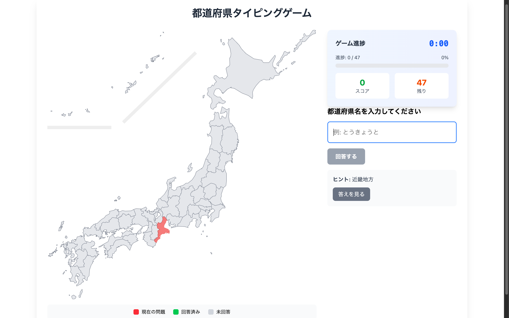

# 都道府県タイピングゲーム

小学生向けの都道府県学習ゲームです。日本地図を見ながら都道府県名をタイピングして覚えることができます。



## 特徴

- 🗾 **インタラクティブな日本地図**: SVG形式の詳細な日本地図を使用
- ⏱️ **時間計測**: 全都道府県制覇までの時間を計測
- 📊 **進捗表示**: リアルタイムで学習進捗を確認
- 💾 **進捗保存**: ブラウザを閉じても進捗が保存される
- 🎯 **視覚的フィードバック**: 回答済み（緑）、現在の問題（赤・点滅）、未回答（グレー）で色分け

## 技術スタック

- **フレームワーク**: [HonoX](https://github.com/honojs/honox) - React Islands Architecture
- **ランタイム**: Cloudflare Workers
- **スタイリング**: Tailwind CSS
- **言語**: TypeScript
- **デプロイ**: Cloudflare Pages

## セットアップ

### 前提条件

- Node.js 18以上
- npm または yarn

### インストール

```bash
# リポジトリをクローン
git clone https://github.com/kajiwara-y/prefecture-typing-game.git
cd prefecture-typing-game

# 依存関係をインストール
npm install
```

### 開発環境での実行

```bash
# 開発サーバーを起動
npm run dev
```

ブラウザで `http://localhost:5173` を開いてゲームを開始できます。

### ビルド

```bash
# プロダクション用にビルド
npm run build
```

## デプロイ

### Cloudflare Pagesへのデプロイ

1. Cloudflare Pagesのダッシュボードで新しいプロジェクトを作成
2. GitHubリポジトリを接続
3. ビルド設定:
   - **ビルドコマンド**: `npm run build`
   - **ビルド出力ディレクトリ**: `dist`
   - **Node.jsバージョン**: `18`

または、Wrangler CLIを使用:

```bash
# Wranglerをインストール
npm install -g wrangler

# ログイン
wrangler login

# デプロイ
npm run deploy
```

## ゲームの遊び方

1. **ゲーム開始**: 画面が表示されると自動的にゲームが始まります
2. **都道府県を確認**: 地図上で赤く点滅している都道府県を確認
3. **名前を入力**: 都道府県名をひらがなまたは漢字で入力
4. **回答**: エンターキーまたは「回答する」ボタンで回答
5. **進捗確認**: 上部の進捗バーで現在の状況を確認
6. **全制覇を目指す**: 47都道府県すべてを回答してゲームクリア！

### 入力例

- ひらがな: `とうきょうと`、`おおさかふ`
- 漢字: `東京都`、`大阪府`
- 省略形: `東京`、`大阪`（都・府・県・道を省略可能）

### ヒント機能

- 各都道府県の地方名がヒントとして表示されます
- 「答えを見る」ボタンで正解を確認できます（スコアには加算されません）

## プロジェクト構造

```
├── app/
│   ├── islands/          # クライアントサイドコンポーネント
│   │   ├── GameControls.tsx
│   │   ├── GameHeader.tsx
│   │   ├── GameProgress.tsx
│   │   ├── JapanMap.tsx
│   │   └── TypingInput.tsx
│   ├── hooks/            # カスタムフック
│   │   └── useGameState.ts
│   ├── utils/            # ユーティリティ
│   │   └── gameState.ts
│   ├── data/             # データ定義
│   │   └── prefectures.ts
│   └── routes/           # ページルーティング
│       ├── _renderer.tsx
│       └── index.tsx
├── public/
│   └── map-full.svg      # 日本地図SVGファイル
├── package.json
├── vite.config.ts
└── wrangler.jsonc
```

## 主要コンポーネント

- **JapanMap**: SVG日本地図の表示と状態管理
- **TypingInput**: 都道府県名の入力と回答処理
- **GameProgress**: 進捗表示と時間計測
- **GameControls**: ゲームのリセット機能
- **GameHeader**: ゲーム開始前のタイトル表示

## 状態管理

HonoXのIslands Architectureに対応した独自の状態管理システムを実装:

- **GameStateManager**: シングルトンパターンでゲーム状態を管理
- **localStorage**: ブラウザ終了後も進捗を保持
- **リアルタイム同期**: 複数のIslandコンポーネント間で状態を同期

## ライセンス

MIT License


## 作者

- [@kajiwara-y](https://github.com/kajiwara-y)

## 謝辞

- フレームワーク: [HonoX](https://github.com/honojs/honox)
- ホスティング: [Cloudflare Pages](https://pages.cloudflare.com/)
- SVG日本地図: [SVG Map of Japan](https://github.com/geolonia/japanese-prefectures)
